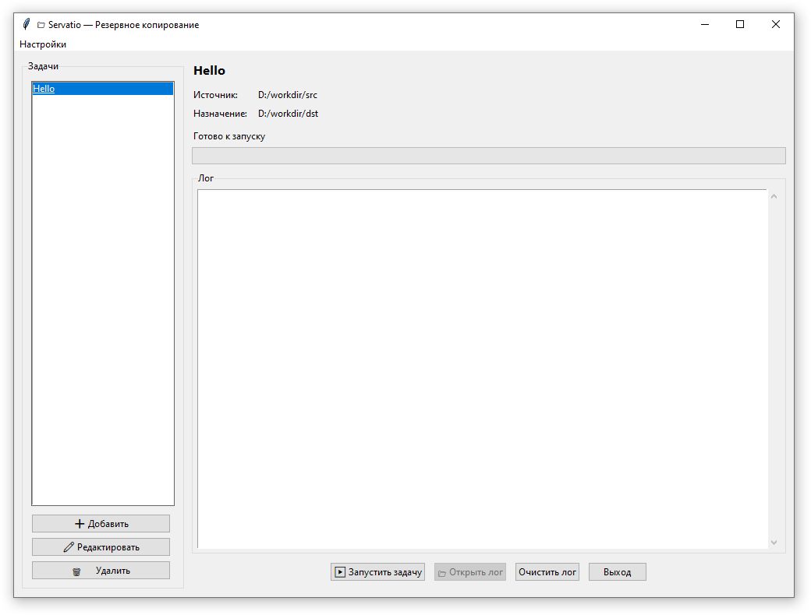

# Servatio

> **Лат. *servatio* — сохранение, охрана**  
> Простая, надёжная и бесплатная программа для резервного копирования и синхронизации файлов на Windows.

Servatio — data tua salvantur" («Servatio — твои данные спасены»)

Servatio — это альтернатива `rsync` для Windows с графическим интерфейсом, поддержкой множества задач, исключений, логированием и уведомлениями.

---

## ✨ Возможности

- 📂 **Множество задач** — создавайте профили для разных папок
- 🔄 **Синхронизация с удалением** (как `rsync --delete`)
- 🚫 **Исключения по шаблонам** (`.git`, `*.tmp`, `__pycache__` и др.)
- 📊 **Прогресс в реальном времени**
- 📝 **Подробное логирование** (автоочистка старых логов)
- 🌓 **Поддержка тёмной темы Windows**
- 🖱️ **Drag & Drop** для выбора папок
- 🔔 **Уведомления в трее** по завершению
- 💾 **Проверка свободного места** перед запуском
- 🛡️ **Безопасность**: защита от случайного форматирования

---

## 🚀 Установка

1. Установите **Python 3.8+** с [официального сайта](https://www.python.org/downloads/)
2. Откройте терминал (Командную строку или PowerShell)
3. Выполните:

```powershell
# Клонируйте репозиторий
git clone https://github.com/ваш-ник/servatio.git
cd servatio

# Установите зависимости
pip install -r requirements.txt

# Запустите программу
python app.py